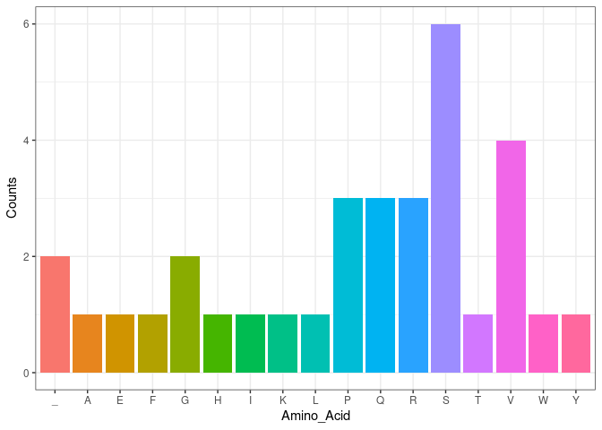
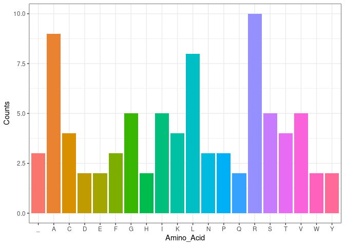

<!-- README.md is generated from README.Rmd. Please edit that file -->

# Introduction to centraldogma

<!-- badges: start -->

[](https://lifecycle.r-lib.org/articles/stages.html#experinental)
<!-- badges: end -->

The
[centraldogma](https://github.com/rforbiodatascience22/group_10_package)
package replicates the central dogma of molecular biology. More
specifically it replicates the flow of genetic information from DNA to
RNA to protein.

The package consists of the following five functions:

-   `generate_dna` generates a random DNA sequence.
-   `transcribe` transcribes a DNA sequence into a RNA sequence.
-   `split_codons` splits a RNA sequence into codons.
-   `translate` translates a RNA codon sequence into a protein sequence.
-   `plot_aa_occurrence` plots the occurrence of each amino acid in a
    protein sequence.

Each function is demonstrated below:

### Generate DNA

The `generate_dna` is used to generate a random DNA sequence. The
`length` argument controls the length of the generated sequence:

``` r
set.seed(6942069)

generate_dna(length = 20)
#> [1] "ACTCTGTCATCAGGCCAACC"
```

### Transcribe DNA to RNA

The `transcribe()` function transcribes a DNA sequence into a RNA
sequence by replacing Thymine (T) with Uracil (U):

``` r
dna_fragment <- "CCATGTTATG"

transcribe(dna_fragment)
#> [1] "CCAUGUUAUG"
```

### Split RNA into Codons

The `split_codons` function splits a RNA sequence into codons. The
`start` argument specifies the start position of the reading frame. The
position can be any position in the RNA sequence with a default value of
one:

``` r
rna_fragment <- "AUCGUACGAUAUGAUACAGAGAUAGACAUAUUUAACGG"

split_codons(rna_fragment, start = 5)
#>  [1] "UAC" "GAU" "AUG" "AUA" "CAG" "AGA" "UAG" "ACA" "UAU" "UUA" "ACG"
```

### Translate RNA Codons into Protein

The `translate` function translates a sequence of RNA codons into a
protein sequence by replacing codons into the amino acids that they code
for using a standard codon table:

``` r
codon_table
#> UUU UCU UAU UGU UUC UCC UAC UGC UUA UCA UAA UGA UUG UCG UAG UGG CUU CCU CAU CGU 
#> "F" "S" "Y" "C" "F" "S" "Y" "C" "L" "S" "_" "_" "L" "S" "_" "W" "L" "P" "H" "R" 
#> CUC CCC CAC CGC CUA CCA CAA CGA CUG CCG CAG CGG AUU ACU AAU AGU AUC ACC AAC AGC 
#> "L" "P" "H" "R" "L" "P" "Q" "R" "L" "P" "Q" "R" "I" "T" "N" "S" "I" "T" "N" "S" 
#> AUA ACA AAA AGA AUG ACG AAG AGG GUU GCU GAU GGU GUC GCC GAC GGC GUA GCA GAA GGA 
#> "I" "T" "K" "R" "M" "T" "K" "R" "V" "A" "D" "G" "V" "A" "D" "G" "V" "A" "E" "G" 
#> GUG GCG GAG GGG 
#> "V" "A" "E" "G"
```

A stop codon is indicated by “\_“.

Here is an example of the use of the function:

``` r
rna_codon_sequence <- c("GGG", "GGC", "GCG", "UCC", "GUC")

translate(rna_codon_sequence)
#> [1] "GGASV"
```

### Plot Amino Acid Occurrences in a Protein

The `plot_aa_occurrence` function makes a plot of the occurrence of each
amino acid in a protein sequence:

``` r
protein_sequence <- "GGASVTVSRFW_PSQSKQRHRVEPVS_IQSYLP"

plot_aa_occurrence(protein_sequence)
```



### Example Workflow

The five functions included in `centraldogma` can be used in a pipeline
as follows:

``` r
set.seed(42069)

dna_sequence <- generate_dna(length = 250)
rna_sequence <- transcribe(dna_sequence)
rna_codon_sequence <- split_codons(rna_sequence)
protein_sequence <- translate(rna_codon_sequence)
plot_aa_occurrence(protein_sequence)
```


